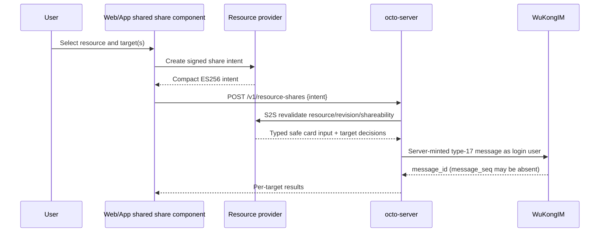

# Resource-share provider onboarding

> Status: draft integration contract for smart-summary, docs, and future
> resource owners. The platform endpoint exists, but production currently has
> zero registered providers and the global flag remains off.

## 1. User-visible flow

The product flow stays provider-neutral:

```text
选择总结/文档 → 转发到聊天 → 选择 DM/群/thread → 发送
```

The provider never implements a target picker or sends an IM message. Web/App
uses the shared resource-share component and performs two user-context calls:



The provider does not proxy the octo-server call by default. The client first
gets an intent from smart-summary/docs and then calls octo-server separately.

## 2. Responsibility split

| Owner | Responsibility |
| --- | --- |
| Web/App shared component | Target picker, idempotency key, provider intent hook, `POST /v1/resource-shares`, partial-result/retry UX |
| Provider user API | Authenticate the user, load authoritative resource/revision, decide whether the actor may share, mint the signed intent |
| octo-server provider adapter | Verify provider configuration, S2S revalidate, map typed provider data into a reviewed server-owned template |
| octo-server platform | Login/Space/target authorization, replay/idempotency, quotas, audit, proof signing, WuKongIM transport |
| Provider landing route | Authenticate the viewer on every open; render the resource, permission-request page, or denial |
| Clients | Verify resource-share proof for real-time and cold-sync messages; mask failures |

## 3. Provider user API

Each provider exposes a user-authenticated intent endpoint. The concrete route
may follow that service's conventions; Web/App normalizes it behind one
`getShareIntent(resource, targets, idempotencyKey)` hook.

Suggested request:

```http
POST /v1/resource-shares/intents
Authorization: <existing user session>
X-Space-ID: <active space>
Content-Type: application/json

{
  "resource_id": "opaque-provider-resource-id",
  "targets": [
    {"kind": "dm", "peer_uid": "u_123"},
    {"kind": "group", "group_no": "g_123"},
    {"kind": "thread", "group_no": "g_123", "short_id": "t_123"}
  ],
  "idempotency_key": "client-generated-opaque-key"
}
```

The provider derives `actor_uid`, `space_id`, `resource_type`, current
`revision`, template, issuer, and timestamps from authenticated/server state.
It must not accept them as authority from request JSON.

Suggested response:

```json
{
  "intent": "<compact ES256 JWS>",
  "expires_at": 1784010000
}
```

The compact intent contains the platform `Intent` fields and exact canonical
targets. Maximum lifetime is five minutes; providers should normally use
60–120 seconds. Intent claims are readable by the client and therefore contain
no secrets, access tokens, raw document/summary content, or internal URLs.

The provider endpoint must:

- authenticate through its existing user identity path and require exact Space;
- verify current actor read/share permission and resource lifecycle;
- resolve the authoritative immutable/monotonic resource revision;
- canonicalize and bound targets before signing;
- rate-limit by actor and resource;
- use one active ES256 `kid` with an overlapping verification ring;
- return a non-enumerating denial for missing vs unauthorized resources;
- never return card JSON, arbitrary URLs, sender fields, proof, or transport
  metadata.

## 4. octo-server call

The shared client sends only:

```http
POST /v1/resource-shares
token: <octo login token>
X-Space-ID: <active space>
Content-Type: application/json

{"intent": "<compact ES256 JWS>"}
```

The login UID and validated Space must equal the signed actor and Space.
octo-server returns one ordered outcome per signed target:
`sent`, `already_sent`, `denied`, `rate_limited`, `failed`, or `unknown`.
The client must never automatically retry `unknown` because WuKongIM may
already have accepted the message.

## 5. Provider S2S revalidation

The octo-server `ProviderAdapter.Revalidate` call is mandatory immediately
before target dispatch. The adapter may reuse an existing authoritative
provider API. If none exists, add a private endpoint similar to:

```http
POST /internal/v1/resource-shares/revalidate
Authorization: <managed service identity>
Content-Type: application/json

{
  "actor_uid": "u_100",
  "space_id": "sp_100",
  "resource": {
    "type": "document",
    "id": "doc_100",
    "revision": "rev_9"
  },
  "template": {"id": "document-share", "version": 1},
  "targets": [{"kind": "group", "group_no": "g_100"}],
  "claims": {"title": "Reviewed bounded title"}
}
```

Suggested typed response:

```json
{
  "resource": {
    "type": "document",
    "id": "doc_100",
    "revision": "rev_9"
  },
  "share_mode": "requestable",
  "card": {
    "title": "Reviewed bounded title",
    "description": "Document",
    "fields": []
  },
  "targets": [
    {
      "target": {"kind": "group", "group_no": "g_100"},
      "allowed": true
    }
  ]
}
```

S2S requirements:

- mTLS or an equivalent managed service identity; no static credential in URLs
  or logs;
- strict request/response byte limits and schema validation;
- bounded timeout, no unbounded retry inside the user request;
- exact resource revision and target echo;
- actor still has permission to share and the resource is still shareable;
- failures/timeouts fail closed before transport;
- logs contain provider/resource reference and correlation ID, never claims,
  content, intent, signatures, tokens, or credentials.

## 6. Public, requestable, and forbidden resources

`share_mode` is provider-owned policy, not client input:

| Mode | Send behavior | Fixed CTA | Open behavior |
| --- | --- | --- | --- |
| `public` | Send safe resource card | 查看详情 | Provider opens resource after current-viewer auth |
| `requestable` | Send only metadata safe for every target viewer | 查看或申请权限 | Provider opens directly when authorized, otherwise shows request page |
| `forbidden` | No transport; target/result is denied | None | None |

For group/thread cards, the same persisted payload may be visible to current
and future members. A requestable card must therefore expose only metadata safe
for all such viewers. A deep link never embeds a bearer token, permanent signed
URL, or access grant. Opening the link always rechecks the current viewer.

Sharing a requestable card does not grant access. Inline permission mutation is
out of scope for the phase-one `octo/v1` human card; the CTA is an
`Action.OpenUrl` to the provider-owned view/request route.

### Current generic-core TODO

The current `ResourceCardInput` has title/description/fields but no access mode,
and `DeepLinkBuilder` receives only `ResourceRef`. Before a provider needs
mode-specific CTA text or a Space-qualified link, extend the typed boundary
with:

- a closed `public | requestable` access-mode enum (never arbitrary CTA text);
- a typed link input containing resource, Space, and access mode;
- validation/snapshot/proof tests proving these fields cannot inject a URL,
  card element, sender, or transport metadata.

If product accepts one fixed “打开” CTA and a provider landing route that decides
view vs request after click, onboarding can proceed without this extension.

## 7. Key ownership and rotation

- Provider intent private key: stored only in smart-summary/docs secret
  management; never copied to octo-server or clients.
- Provider intent public keys: pinned in the reviewed octo-server provider
  configuration; no request-triggered JWKS discovery.
- Platform proof private key: stored only in octo-server.
- Platform proof public ring: published through
  `GET /v1/resource-shares/proof-jwks` for clients.
- Rotation uses overlapping old/new keys. Provider keys overlap beyond the
  maximum intent lifetime; platform proof keys overlap for persisted-message
  retention.

## 8. Rollout and rollback

1. Land provider brief and owner-confirmed field/access policy.
2. Implement provider intent API and S2S revalidation with contract tests.
3. Register the provider in octo-server with its public keys, schema, template,
   deep-link policy, limits, and adapter; keep provider disabled.
4. Ship Web/App proof verification and shared share UX.
5. Run cross-repository E2E for DM, group, thread, public, requestable, denial,
   stale revision, retry, key rotation, and provider outage.
6. Configure proof keys, enable one provider for a bounded canary, then enable
   the global share flag.
7. Rollback by disabling the provider first, then the global flag. Keep proof
   verification/JWKS available for historic cards.

smart-summary and docs are independent increments. One may be enabled while the
other remains unregistered or disabled.

## 9. Provider acceptance checklist

- [ ] User API derives actor/Space/revision and signs exact canonical targets.
- [ ] Same resource/target retry is idempotent; reuse of one nonce with a
      changed fingerprint fails closed.
- [ ] S2S revalidation fails closed on stale revision, permission change,
      timeout, malformed response, or provider outage.
- [ ] Public/requestable/forbidden modes have explicit safe-field policy.
- [ ] Deep link rechecks current viewer and carries no access credential.
- [ ] Provider private key never reaches octo-server, client, logs, or DB audit.
- [ ] Provider public-key rotation passes old/new overlap tests.
- [ ] Web/App cannot submit card JSON, URL, sender, proof, or transport fields.
- [ ] DM/group/thread E2E verifies actual WuKongIM payload and platform proof.
- [ ] Metrics use bounded labels and alert on denial, provider failure,
      rate-limit, unknown transport, and revalidation latency.
